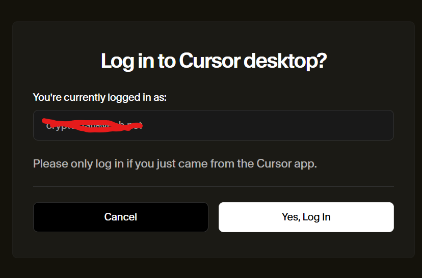

# ✨ **Cursor Free VIP 教程**
无限注册白号，永久免费享受 Cursor 官方的 Free Plan 服务。Free plan 仅能使用 Agent-Auto 模型，但功能已足够强大，满足普通用户常规使用。

## 🖥️ **支持平台**

- 
- 
- 
-  &nbsp;&nbsp;&nbsp;&nbsp;&nbsp;&nbsp;&nbsp;&nbsp;&nbsp;&nbsp;&nbsp;➡️[如何在 Windows 上安装 WSL2 Ubuntu](https://medium.com/@cryptoguy_/在-windows-上安装-wsl2-和-ubuntu-a857dab92c3e)
---

## 🚀 **快速开始**

### 前提条件

- 已安装 [Cursor 客户端](https://www.cursor.com/cn)，如下图

<div align="center">
  
</div>

- 如果使用 chat 时出现以下提示，如下图
<div align="center">
  
</div>
<p align="center">或者</p>
<div align="center">
  
</div>
请先打开"文件-首选项-Cursor Settings"中点击 **log out** 退出账户，然后执行以下操作。

---

### 根据系统环境安装并运行脚本

<details open>
<summary><b>Linux / WSL / macOS 系统</b></summary>（必须已安装 git，如未安装请参考➡️<a href="./安装git教程.md">安装git教程</a>）

```bash
# 首次安装和运行
git clone https://github.com/oxmoei/cursor-free-vip.git && cd cursor-free-vip && ./install.sh

# 以上安装成功后，下次再运行可直接执行以下命令
sudo python3 ~/.cursor-vip-src/cursor-free-vip-1.11.03/main.py
```
</details>

<details open>
<summary><b>Windows 系统</b></summary>（必须已安装 git，如未安装请参考➡️<a href="./安装git教程.md">安装git教程</a>）

> ⚠️ **请以管理员身份启动 PowerShell，依次执行以下命令：**

```powershell
# 首次安装和运行
Set-ExecutionPolicy Bypass -Scope CurrentUser -Force
git clone https://github.com/oxmoei/cursor-free-vip.git
cd cursor-free-vip
.\install.ps1

# 以上安装成功后，下次再运行可直接执行以下命令
python "$env:USERPROFILE\.cursor-vip-src\cursor-free-vip-1.11.03\main.py"
```
</details>

---

### 🤖 **互动式操作步骤**

<div align="center">
  
</div>

- 1️⃣ 输入 `3`，**关闭 Cursor 应用**。
- 2️⃣ 输入 `1`，**重置机器 ID**。
- 3️⃣ 访问 [https://www.temporam.com/zh](https://www.temporam.com/zh) 复制临时邮箱（可无限刷新）

<div align="center">
  
</div>

- 4️⃣ 浏览器“无痕模式”访问官网 [https://www.cursor.com/cn](https://www.cursor.com/cn) ，使用临时邮箱进行注册。假如需要手机验证码则使用接码平台。
- 5️⃣ 打开 **Cursor** 客户端"文件-首选项-Cursor settings"，右键点击 **Sign in** 复制链接，粘贴到你刚才登录cursor的浏览器输入栏，回车，弹窗点击 **Yes,Log In**。

<div align="center">
  
</div>

**🎉🎉完成以上，你的 Cursor 即可重新激活 Free plan 功能。**
---

## ❓ **常见问题**

- 更多帮助请访问 [项目主页](https://github.com/oxmoei/cursor-free-vip.git) 或提交 issue。

---

> 💡 **如需进一步美化或有特殊需求，欢迎联系作者！**
